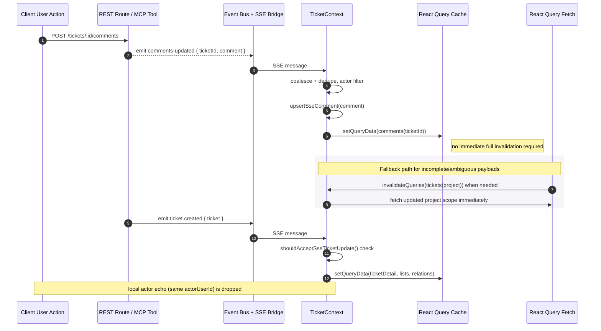
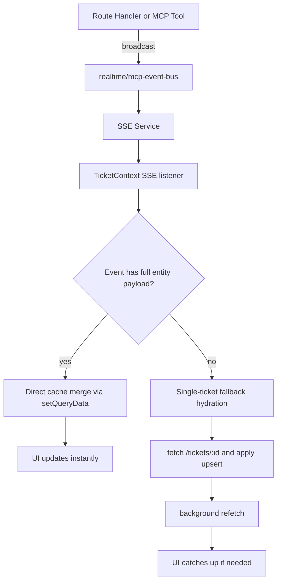

# Fixing Real-Time Refresh / Cache Churn (SSE Architecture)

## Why this change was needed

The UI was refreshing too aggressively because two systems were trying to do the same sync work:

* UI actions performed optimistic mutation writes.
* SSE handlers also invalidated queries immediately.
* Some requests used the same cache entries again, causing full refetch churn.

The goal is to remove the user-visible full refresh behavior while still keeping everyone synchronized in near real time.

## Design decision

We now use a **cache-first SSE pipeline**:

1. Make SSE payloads richer so the client can apply updates directly.
2. Update only the affected query cache entries in memory (`setQueryData`).
3. Use **coalesced + immediate single-entity fallback hydration** when payloads are incomplete.
4. Keep stale UI data visible during background fetches with `keepPreviousData`.
5. Keep ticket detail caches warm by using `staleTime: Number.POSITIVE_INFINITY` and relying on SSE for freshness.
6. Remove unconditional periodic polling; refresh is event-driven, with immediate single-ticket fallback hydration only for incomplete payloads.
7. Bump `updatedAt` on optimistic client writes (`Date.now()`/`toISOString()`) before cache writes so local intent has recency metadata.

## Data contract changes (server side)

### Ticket mutation events

`routes.ts` and `mcp.ts` now include ticket bodies in SSE payloads:

* `ticket.created` => `data.ticket`
* `ticket.updated` => `data.ticket`
* `ticket.deleted` => `data.ticket` and `data.ticketId` where available

### Comment mutation events

* `comment.added` => `data.comment`, `data.commentId`, `data.ticketId`, `data.ticketKey`
* `comment.updated` => `data.comment`, `data.commentId`, `data.ticketId`, `data.ticketKey`
* `comment.deleted` => `data.commentId`, `data.ticketId`, `data.ticketKey`

### List refresh events

* `tickets-updated` now includes `data.ticket` when available.
* `comments-updated` keeps ticket-level targeting via `messageData.ticketId`.

## Client event architecture (`TicketContext.tsx`)

### 1) SSE subscription and parsing

`TicketContext` subscribes in a single effect:

* reads events from the workspace `sseService`,
* filters events with matching `actorUserId` (skip local actor echo),
* normalizes event shape into `SseCoalescedEvent`,
* forwards to `SseEventCoalescer`.

### 2) Coalescer + batch handler

Events are processed in batches and mapped by type:

* `ticket.created` / `ticket.updated`
  * if `messageData.ticket` exists, apply direct cache upsert.
  * else fetch `GET /tickets/:id` and apply single-ticket upsert.
* `ticket.deleted`
  * remove from caches immediately using `ticketKey`/`ticketId`.
* `comment.added` / `comment.updated` / `comment.deleted`
  * apply direct comment cache add/update/delete if full payload exists,
  * otherwise invalidate the active comments query for that ticket.
* `labels.*`, `dependency.*`, `tickets-updated` without payload
  * fallback to targeted single-ticket hydration when possible.

### 3) Direct cache upsert helpers in context

#### `upsertTicketFromSse(ticket)`

* Normalizes payload to ticket shape.
* Updates ticket details for:
  * `queryKeys.ticketDetail(ticketId)` and relation/detail key space `['tickets','detail',ticketKey]` / `['tickets','relations',ticketKey]`.
* Updates every ticket list query under `['tickets', { projectId }]`:
  * insert if new and belongs to project,
  * update matching row,
  * remove from old project list if ticket moved.

#### `upsertSseComment(comment)`

* Writes comment directly into `queryKeys.comments(ticketId)` list cache.

#### `removeSseComment(ticketId, commentId)`

* Removes one comment from `queryKeys.comments(ticketId)`.

#### `removeSseTicketEntries(ticketKey, ticketId)`

* Removes matching ticket rows from all list queries.
* Clears detail and relation queries for the ticket key.
* Clears active comments/detail cache for the ticket id.

### 4) Optimistic concurrency control

Because optimistic UI writes can race with SSE, we compare timestamps before applying SSE cache writes.

* If incoming `updatedAt` is older than or equal to the cache value, the SSE event is ignored for that target entry.
* This avoids reverting local user actions with stale events.

Implemented by:

* `shouldAcceptSseTicketUpdate(existing, incoming)` for tickets
* `shouldAcceptSseCommentUpdate(existing, incoming)` for comments
* `combineTicketDetails(existing, incoming)`
* All optimistic mutation paths add `updatedAt` using `new Date().toISOString()` before `setQueryData`

Optimistic paths updated:

* `addComment` / `updateComment` in `TicketContext`
* `updateTicket` in `TicketContext`
* `useMoveTicket` optimistic ticket list and active ticket mutations
* relation mutations in `useTicketRelationActions`

### 5) Background fallback strategy

Instead of delayed periodic refreshes, SSE updates now use single-ticket fallback hydration:

* `queryKeys.tickets(projectId)` no longer invalidates immediately; we first attempt `GET /tickets/:id` and then `setQueryData`.
* `queryKeys.comments(ticketId)` invalidates only when active comment detail is affected and ticket is known.
* `invalidateAggregateTicketQueries(projectId)` still runs when we need aggregate cache refresh for workspace/team list views.

### 6) Keep rendering smooth

`keepPreviousData` is now used in long-lived queries that may be invalidated:

* `queryKeys.tickets(activeProjectId)`
* `queryKeys.comments(activeTicketId)`
* `useTicketRelationActions` active ticket detail query (`queryKeys.ticketDetail(activeTicketId || '')`)

This prevents spinner/flicker when a background invalidation lands.

Ticket detail stale-time is intentionally long (`Number.POSITIVE_INFINITY`) so those components don't repeatedly re-fetch without event-driven invalidation.

## Why this solves the issue

* User actions no longer force broad, immediate cache invalidation from both mutation and SSE paths.
* Most remote events now mutate cache in place and only touch precise keys.
* Background sync remains visible-stable.
* The app keeps working even when payloads are partial by per-ticket fallback hydration.

## Files changed

* [client/src/context/TicketContext.tsx](/home/lance/Documents/Code/Gravity/client/src/context/TicketContext.tsx)
* [client/src/hooks/useTicketRelationActions.ts](/home/lance/Documents/Code/Gravity/client/src/hooks/useTicketRelationActions.ts)
* [docs/SSE/real-time-cache-strategy.md](/home/lance/Documents/Code/Gravity/docs/SSE/real-time-cache-strategy.md)
* [client/src/utils/queryClient.ts](/home/lance/Documents/Code/Gravity/client/src/utils/queryClient.ts)
* [server/src/modules/tickets/routes.ts](/home/lance/Documents/Code/Gravity/server/src/modules/tickets/routes.ts)
* [server/src/modules/tickets/mcp.ts](/home/lance/Documents/Code/Gravity/server/src/modules/tickets/mcp.ts)

## Current event-to-cache matrix

* `ticket.created` -> `upsertTicketFromSse` (primary), single-ticket hydration fallback
* `ticket.updated` -> `upsertTicketFromSse` (primary), single-ticket hydration fallback
* `ticket.deleted` -> `removeSseTicketEntries` (primary)
* `comment.added` -> `upsertSseComment` (primary)
* `comment.updated` -> `upsertSseComment` (primary)
* `comment.deleted` -> `removeSseComment` (primary)
* `tickets-updated` -> `upsertTicketFromSse` when ticket payload exists else single-ticket hydration fallback
* `comments-updated` -> comments invalidation when ticketId is available
* `users-updated` -> immediate users invalidation

## Sequence flow

## SSE path diagram by actor source

