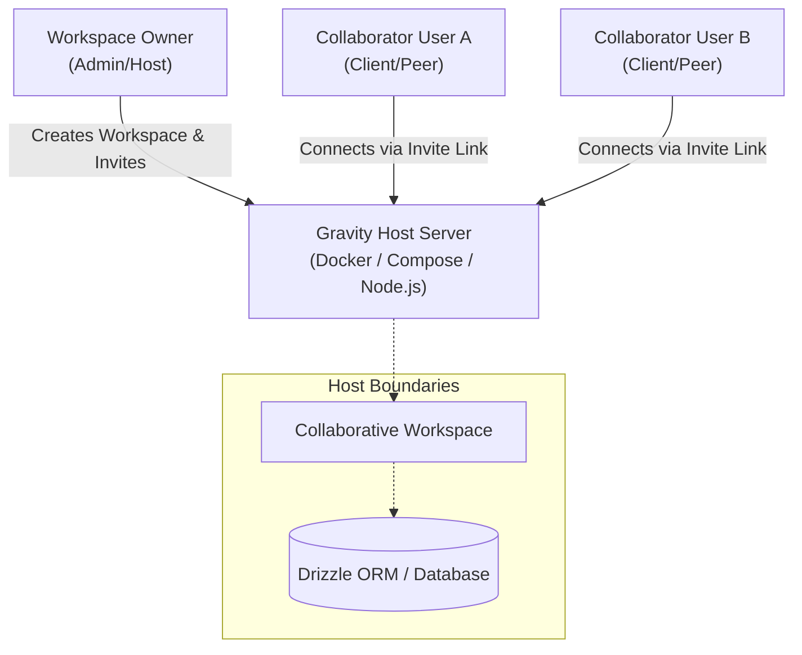

# Gravity Self-Hosted Server Flow

This document details the architecture and operational flow of the Gravity self-hosted server model. It explains how a single host server operates, how peer users connect to it, and the underlying mechanics of the workspace invitation and access lifecycle.

---

## 1. Architectural Overview

Gravity operates on a **Host-Peer Model** for self-hosted instances. Rather than running completely isolated local silos, a single user or organization hosts a central **Gravity Server** (the "Host") which serves as the collaborative hub. Other users (the "Peers" or "Collaborators") connect directly to this Host to access shared workspaces, projects, and tickets.



> [!NOTE]
> The host machine handles database storage, session routing, and MCP (Model Context Protocol) tool integrations, ensuring all data remains securely hosted under the organization's or owner's control.

---

## 2. The Workspace & Invitation Lifecycle

The primary mechanism for onboarding other users onto a self-hosted host is the **Workspace Invitation Flow**. Below is the sequence of actions that occur when an owner sets up a server and invites collaborators.

### Step 1: Workspace Creation (Owner)
The Workspace Owner creates a shared collaborative workspace with a unique cryptographic key.

*   **API Endpoint**: `POST /api/v1/workspaces`
*   **Payload**:
    ```json
    {
      "name": "Remote Operations",
      "description": "Central Operations Hub",
      "key": "ROPS",
      "workspaceKey": "ROPS-SECRET-KEY",
      "ownerId": "owner-user-uuid",
      "defaultProjectName": "Core Engine",
      "defaultProjectKey": "ENG"
    }
    ```

### Step 2: Creating an Invitation Link (Owner)
To invite peers, the owner generates an invitation. This creates a secure, unique invite token in the database.

*   **API Endpoint**: `POST /api/v1/workspaces/:workspaceId/invites`
*   **Payload**:
    ```json
    {
      "label": "Engineering Team Invitation"
    }
    ```
*   **Response**: Returns a unique `code` (e.g., `inv_abc123xyz`). The invite URL distributed to users will look like:
    ```
    http://<host-ip-or-domain>/join/inv_abc123xyz
    ```

> [!TIP]
> Owners can view and manage all active invites by performing a `GET /api/v1/workspaces/:workspaceId/invites`.

### Step 3: Joining Request (Peer/Collaborator)
When a peer clicks the invitation link or inputs the code, they submit a request to join the workspace.

*   **API Endpoint**: `POST /api/v1/workspaces/invites/:code/join-requests`
*   **Payload**:
    ```json
    {
      "userId": "collaborator-user-uuid",
      "message": "Requesting access to collaborate on the Core Engine."
    }
    ```
*   **Status**: The request is created in a `pending` state.

### Step 4: Approval (Owner)
The host owner reviews pending join requests.

1.  **Retrieve Pending Requests**: `GET /api/v1/workspaces/:workspaceId/join-requests`
2.  **Approve Request**: `POST /api/v1/workspaces/:workspaceId/join-requests/:requestId/approve`
    ```json
    {
      "reviewerUserId": "owner-user-uuid"
    }
    ```

Once approved, the status transitions to `approved`, and the peer is officially added to the workspace membership table (`workspace_users`).

### Step 5: Collaboration Access
Once approved, the collaborator has full API access to projects, members list, and ticket flows associated with the workspace:
*   Listing workspace members: `GET /api/v1/workspaces/:workspaceId/members`
*   Viewing projects: `GET /api/v1/projects?userId=:collaboratorId&workspaceId=:workspaceId`

---

## 3. Workspace Settings & Security Federation

The Host Server offers fine-grained configuration parameters so that self-hosted environments can adapt to security policies.

### Settings Configuration
The Owner can adjust workspace settings or rotate cryptographic parameters seamlessly.

*   **API Endpoint**: `PATCH /api/v1/workspaces/:workspaceId/settings`
*   **Payload Parameters**:
    *   `hostUrl`: Define the base URL where the host is exposed (e.g., `https://gravity.mycompany.internal`).
    *   `joinMode`: Determines onboarding rules:
        *   `approval_required` (default): Guests require explicit approval to join.
        *   `open`: Anyone with the link is automatically admitted.
    *   `workspaceKey`: Allows manual rotation of the secure workspace symmetric key.

> [!WARNING]
> Rotating the `workspaceKey` should be done with care as it is used to authenticate secure workspace payloads and cryptographic validation across federated agents.
